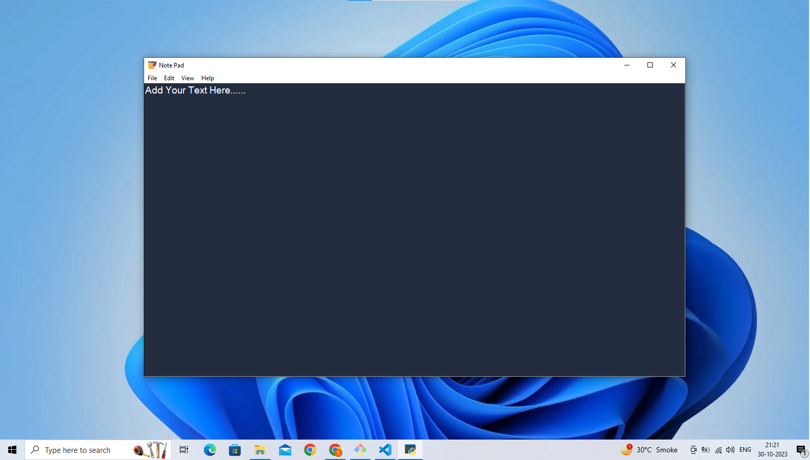

# Note Pad
##  A simple Python Tkinter GUI application for Managing Text Files
I created a simple notepad in Python using Tkinter .<br>
This Notepad GUI will consist of various menu like file and edit, <br>
using which all functionalities like saving the file, opening a file, editing,
cut and paste can be done.



## Features
In this applicaton, I added all the functionality that is required in the notepad like<br> 
You can saving a file in txt form , open a txt file, <br>
You can Edit a text file like  cut , copy, paste. <br>
You can change size of view like  zoom in and zoom out,
and some other features

## Installing
You can just download my code and run this command. (no need of external package).
```shell
python index.py
```
OR You can just download .exe file
[**`NotePad.exe`**](https://github.com/rajvinder21/notepad.exe)

# License
<a href="https://choosealicense.com/licenses/mit/">MIT<a>

Happy Coding! 🚀
